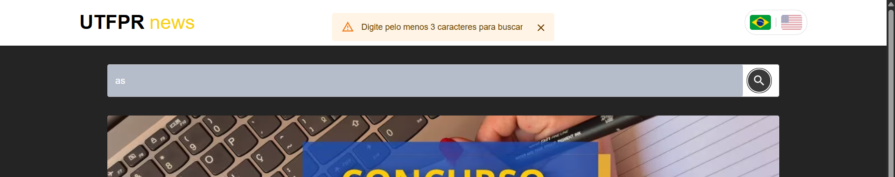

# Projeto de Oficina de Integração 2
Este projeto foi criado para a disciplina de Programação Full-Stack. 
Nosso objetivo consiste em criar uma plataforma capaz de realizar pesquisas de noticias utilizando a API thenewsapi.

## Como rodar o projeto localmente
### 1. Instalação de dependências
Utilize o comando <pre> ```npm install``` </pre> dentro do terminal da pasta do projeto.
### 2. Iniciar Frontend
Após a instalação das dependências utilize o comando <pre> ```npm run dev``` </pre> no terminal do projeto para iniciar o Frontend.
### 3. Rota do navegador
Entre na rota http://localhost:5173/ no seu navegador para poder utilizar a aplicação

## Critérios de avaliação
Os critérios de avaliação definidos na proposta do Projeto 1 foram atendidos e podem ser identificados do seguinte modo:
- ### Atendimento as diretrizes de desenvolvimento web apresentadas durante as aulas. 
A forma como o projeto foi desenvolvido segue a forma como o conteúdo foi abordado dentro das aulas disponibilizadas.
- ### Estrutura do projeto utilizando Webpack/create-react-app ou outra estrutura concordada com o professor (por exemplo o Vite).
A estrutura utiliza no presente trabalho foi o Vite.
- ### Busca com envio de parametros para a API JSON.
É feita a busca por meio de parâmetros para a API dentro da pasta `src\components\NewsList\index.jsx` onde, dentro do useEffect, é utlizado o fetch com a URL alterada com parâmetros de pesquisa, sendo eles: *API_KEY* (variável para realizar a conexão do sistema com a API), *searchTerm* (variável utlizada para realizar buscas), *state.page* (variável utilizada para definir a página desajada dentre os resultados obtidos) e *language* (variável que define a linguagem do site e das notícias obtidas).
- ### Verificação de preenchimento de campos obrigatórios na busca. 
A verificação é realizada dentro da searchBox no início da tela, sendo **necessário inserir pelo menos 3 caracteres** para que a busca seja validada. 
- ### Apresentação de mensagens de erro de validação antes e depois do envio dos dados para a API.
São apresentadas as mensagens assim como solicitado.
- ### Implementação de componentes e comunicação de componentes React.js com a Context API ou REDUX.
Os componentes criados se comunicam utilizando a **Context API** e está localizada na pasta `src\contexts`
- ### Implementação da funcionalidade/hook selecionado pelo grupo.
O hook escolhido foi o useReducer, o qual ainda atuou em conjunto com o useContext, useEffect e useState. Sua implementação está no arquivo `src\components\NewsList\index.jsx`
- ### Uso de uma biblioteca externa selecionada pelo grupo.
Foi utilizado a [Material UI](https://mui.com/material-ui/).
- ### Geração do pacote de deployment da aplicacção e disponibilização em um servidor web.
O deploy da aplicação dentro de um servidor web pode se acessa através do link: 
- ### Atualização incremental das mudanças de código-fonte no Git.
Os commits e atualizações foram feitos de forma incremental, seguindo a solicitação do professor.

## Tecnologias Utilizadas
### Front-end
React com JavaScript.
#### Hooks
Foram utilizados os seguintes hooks:
- useReducer
- useContext
- useEffect
- useState
#### Biblioteca externa
Como biblioteca para auxiliar no desenvolvimento foi utilizada a [Material UI](https://mui.com/material-ui/)
### API Publica
Foi utilizada a API publica **thenewsapi** que fornece diversas notícias de forma gratuita, pode ser acessada atraves do seguinte [link](https://www.thenewsapi.com/).
### Ferramentas de Gerenciamento
Trello e Discord.

## Autores
- [@Gustavo Bueno de Carvalho](https://github.com/gustavo-bueno)
- [@Marcos Vinícius Bueno Prestes](https://github.com/BuenoMVP)